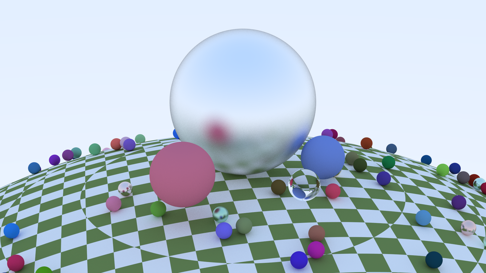
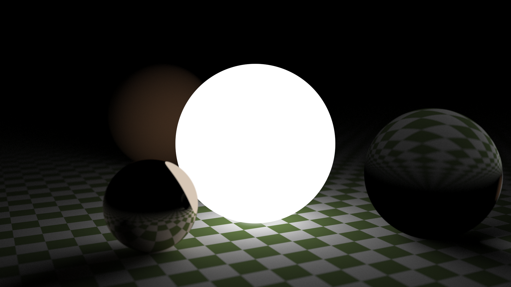

# Rayracer in Rust

 My attempt at writing a raytracer in rust (while never having touched neither rust nor rayracers before). Heavily inspired by [Ray tracing in one weekend](https://raytracing.github.io/books/RayTracingInOneWeekend.html)

